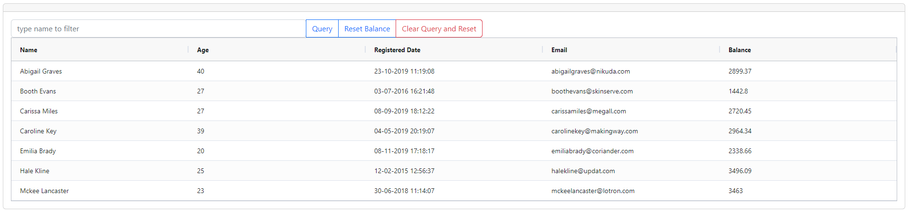
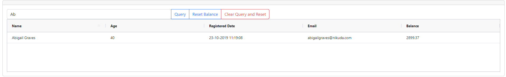
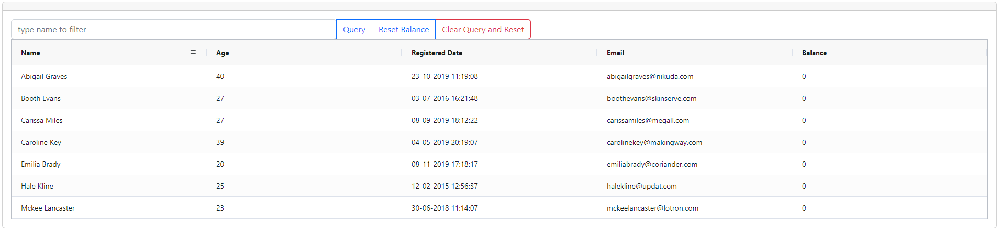
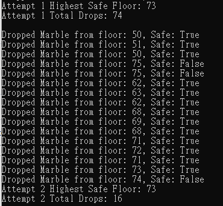

# FariaCodingTest
## Frontend
* I was used third party package as below to satisfy the requirements of word file.
  * Bootstrap
  * [ag-grid](https://www.ag-grid.com/javascript-data-grid/getting-started/)
* Table would be like as below image
  * 
* Query by name
  *  
* Reset balance
  *  
## Backend
* I was used binary search to make the time complexity less than loop each floor.
 * Result would be like
  *    
